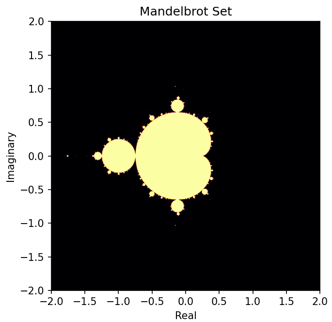
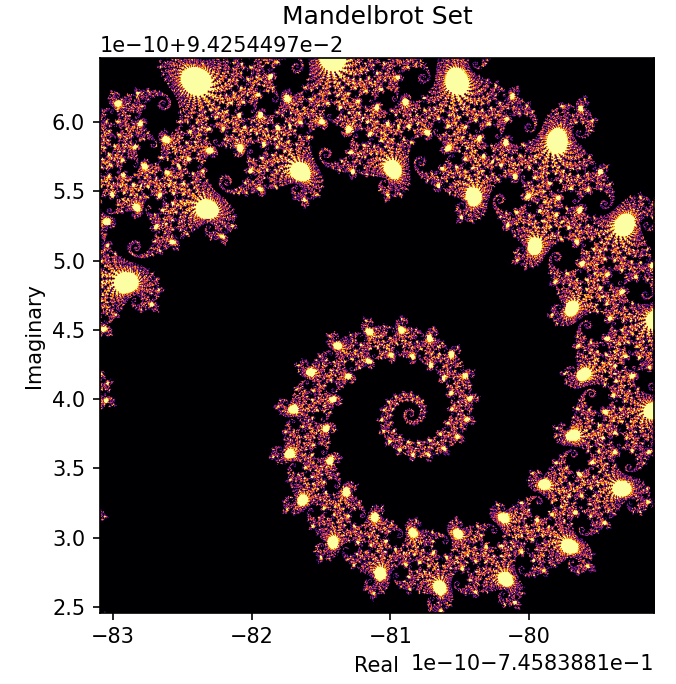

# Dynamic Mandelbrot Set Visualizer

## Description

The Dynamic Mandelbrot Set Visualizer is a Python tool that leverages `pyplot` and `numpy` to create an interactive and dynamic visualization of the Mandelbrot fractal set. This tool allows you to explore the mesmerizing beauty of the Mandelbrot set by adjusting various parameters to generate stunning visual representations.

## Screenshots

The initial rendering.

Exploring seahorse valley.

<!-- Add more screenshots or media here as needed -->
